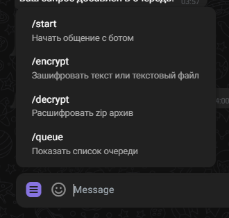
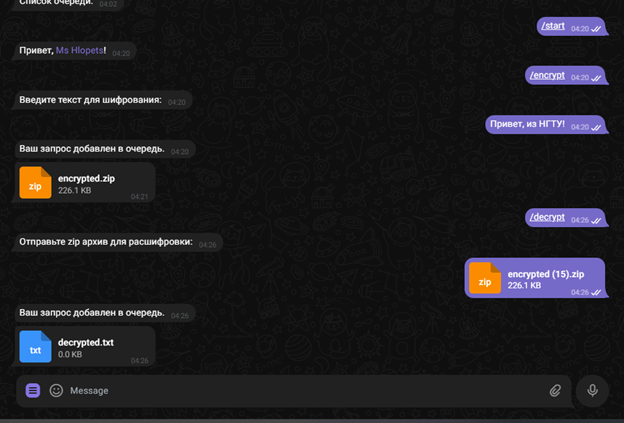
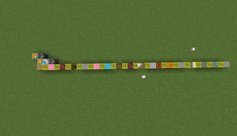

# SBSecurity

**Minecraft-бот с интеграцией в Telegram**  
Шифрование и расшифровка текста с помощью блоков в Minecraft – текст превращается в структуру из блоков внутри игрового мира.

> Бот получает текст или файл, строит его блоками в Minecraft, упаковывает результат в архив. При расшифровке – читает блоки и восстанавливает исходное сообщение.

---

## 📁 Структура проекта

| Файл | Назначение |
|------|------------|
| `bottelegram.py` | Реализация Telegram-бота – приём сообщений, очередь, отправка файлов |
| `serversbs.js` | Связующее звено между Telegram и Minecraft – обработка архивации, очистка папки, запуск бота Minecraft |
| `bot.py` | Основная логика шифрования/расшифровки – преобразование текст ↔ блоки Minecraft |

---

## 🚀 Быстрый запуск (Docker)

1. Склонируйте репозиторий:
```bash
git clone https://github.com/SpongebobGatik/SBSecurity
cd SBSecurity/minecraft-bot
```

2. Создайте файл `.env` и укажите токен Telegram-бота:
```
TELEGRAM_TOKEN=ваш_токен_здесь
```

3. Соберите и запустите образ:
```bash
docker-compose build
docker-compose up -d
```

---

## 🛠 Ручная установка и запуск

1. Склонируйте репозиторий и распакуйте `project.zip`
2. Добавьте переменную окружения с токеном Telegram-бота:
```bash
export TELEGRAM_TOKEN=ваш_токен_здесь
```
3. Установите зависимости:
   - **Python**: `pip install python-telegram-bot>=20.0`
   - **Node.js**: `npm install mineflayer iconv-lite archiver unzipper`
4. Скопируйте папки из директории `packages` в `site-packages` Python
5. Запустите сервисы:
```bash
node serversbs.js &
python3 bottelegram.py
```

---

## 🎮 Как это работает

- **Шифрование**: отправьте текст или `.txt`-файл → бот строит сообщение блоками в Minecraft → упаковывает папку мира в `.zip`-архив.
- **Расшифровка**: отправьте `.zip`-архив → бот читает структуру блоков в Minecraft → восстанавливает исходный текст.

---

## 🤖 Команды Telegram-бота

| Команда | Описание |
|---------|----------|
| `/start` | Приветственное сообщение |
| `/encrypt` | Зашифровать текст или текстовый файл (до 10 МБ, ≤100 000 символов) |
| `/decrypt` | Отправить ZIP-архив для расшифровки |
| `/queue` | Показать текущую очередь запросов |

> ⏱ Ограничение: `/encrypt` можно использовать не чаще 1 раза в 15 минут на пользователя.

---

## 📸 Демонстрация работы

### Меню команд Telegram-бота


### Вид бота во время шифрования/расшифровки в чате


### Сгенерированный мир в Minecraft


---

## ⚙️ Требования

- **Docker** + **Docker Compose** (для быстрого запуска)
- **Или** вручную: Python 3.7+, Node.js 14+, Java (для запуска Minecraft-сервера)

---

## ⚠️ Примечания

- Максимальный размер файла: **10 МБ**
- Максимальный объём текста: **100 000 символов** (длина строки × количество строк)
- Шифрование ставит запрос в очередь – запросы обрабатываются по очереди с задержкой 5 секунд
